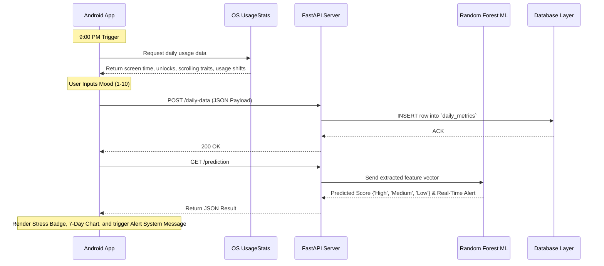

# System Architecture

## Overview
The architecture of **Wellness Wave** encompasses a three-tier design combining a mobile client, a Python backend server, and a cloud-based PostgreSQL database.

## Components Breakdown

### 1. Presentation & Data Collection Layer (Android App)
**Path:** `/wellness_wave_app/`
- **Framework:** Native Android (Kotlin)
- **Platform Target:** Android
- **Core Libraries:**
  - `Retrofit` / `OkHttp`: For executing REST API requests to the backend.
  - `MPAndroidChart`: Graph rendering for 7-day trends.
  - `WorkManager`: To process background sync jobs reliably.
  - `SharedPreferences` / `DataStore`: Lightweight local storage for the user UUID.

### 2. Business Logic & ML Serving Layer (FastAPI Backend)
**Path:** `/wellness_wave_backend/`
- **Framework:** FastAPI / Python 3
- **Core Libraries:**
  - `fastapi` & `uvicorn`: High-performance asynchronous API framework and server.
  - `pydantic`: Automatic data validation of incoming JSON payloads from the Flutter app.
  - `supabase` / `firebase-admin`: Official Python client to interact securely with the remote database (PostgreSQL or Firestore).
  - `scikit-learn` & `joblib`: Machine learning model construction, serialization, and runtime loading for the prediction routes.

### 3. Data Persistence Layer (Supabase / Firebase)
**Type:** Managed Cloud PostgreSQL (Supabase) or NoSQL (Firebase Firestore)
- **Schema/Collection Name:** `daily_metrics`
- **Description:** Centralized log that stores daily screen-time arrays, unlock instances, timestamps, inputted user mood scores, and historically computed ML predictions to retrain models continuously.

## Data Flow Diagram

