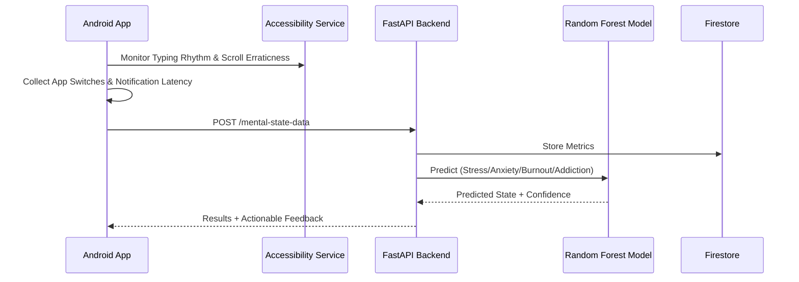

# System Architecture

## Expanded Data Flow
The system now monitors high-frequency behavioral traits via the Accessibility Service and Usage Stats API.

## ML Components
- **Input Features (Feature Vector):**
    - `typing_cps` (characters per second)
    - `backspace_rate`
    - `scroll_velocity_std_dev`
    - `notification_response_sec`
    - `app_switch_count_per_hour`
- **Output:** Multi-class label for the detected mental state.
